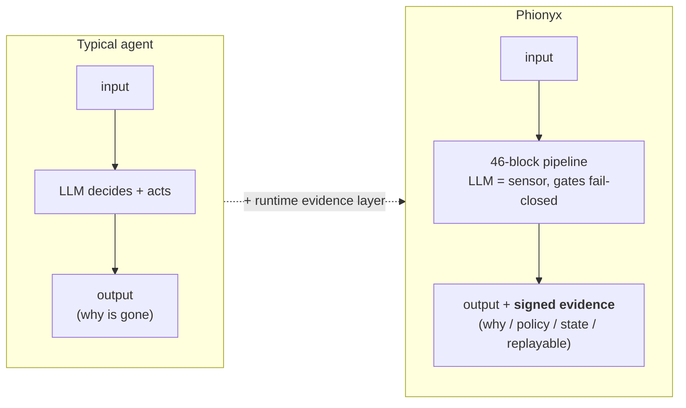
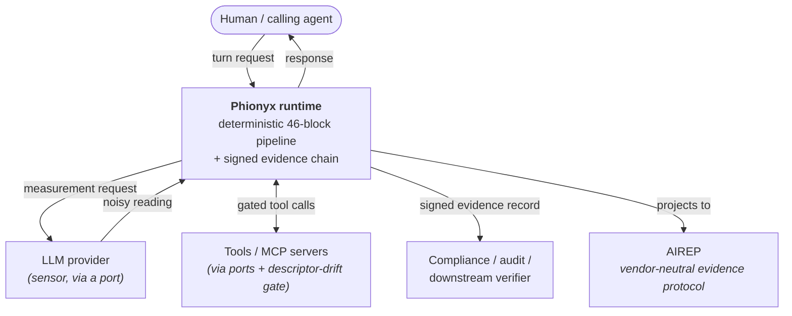
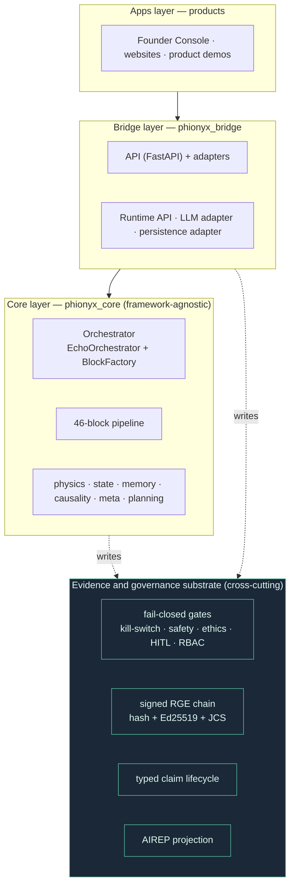
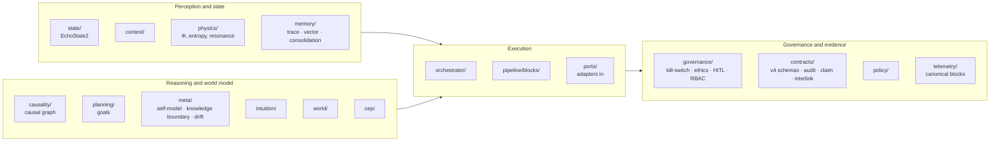
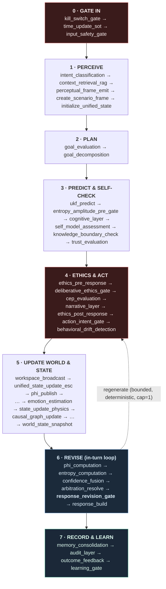
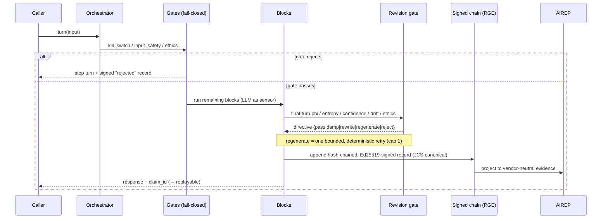
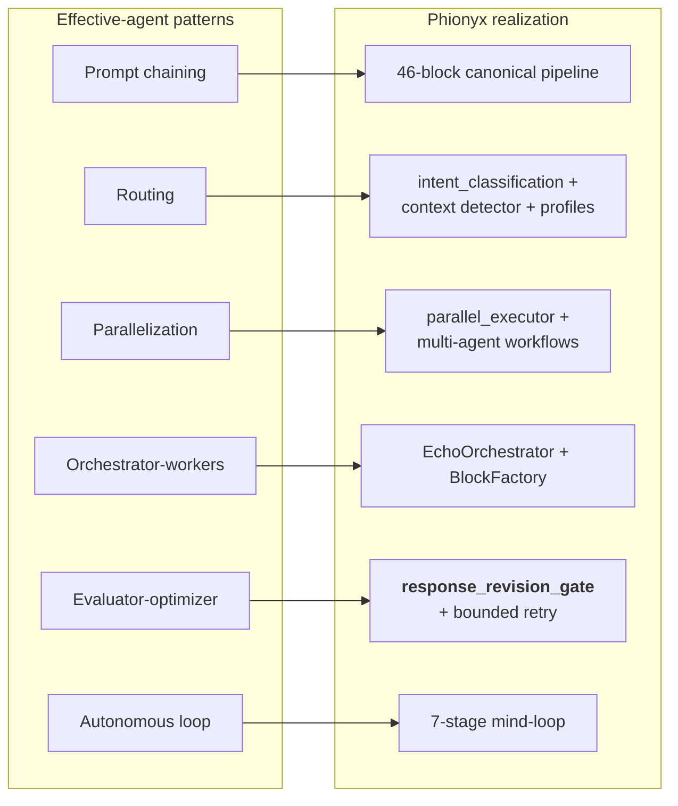

# Phionyx — Architecture

> **A deterministic, auditable runtime that turns AI decisions into signed, replayable evidence.**

| | |
|---|---|
| **Document version** | 2.0.0 |
| **Last updated** | 2026-06-06 |
| **Applies to** | `phionyx-core` ≥ 0.8.1 · pipeline contract v3.8.0 (46 canonical blocks) |
| **Type** | Explanation (Diátaxis) — the *why* and the *shape*, not a how-to |
| **Audience** | Architects, AI-safety & agent researchers, senior engineers |
| **Diagrams** | Mermaid (renders inline on GitHub) |

> **About this document.** It is written by a Claude agent operating *inside* the Phionyx
> repository — an agent whose own edits are gated, grounded, and recorded by the very runtime
> described here. Producing this file went through Phionyx's governance: every claim was bound
> to a same-turn read of the code, large edits passed a runtime gate, and the commit emitted a
> signed evidence record. The system documents itself by being used to govern its own
> documentation. Where that dogfooding is load-bearing, it is called out as **▣ dogfood**.

---

## 1. Executive summary (BLUF)

Modern AI agents are powerful and **opaque**: when an agent changes a file, calls a tool, or
makes a decision, the *why* — which policy allowed it, what evidence it used, what state it
changed, whether it can be reproduced — usually evaporates. Phionyx is the layer that keeps it.

Phionyx treats **LLM output as a sensor reading, not as truth** (Axiom 1), and runs every turn
through a **fixed, contract-versioned pipeline of 46 canonical blocks**. Safety and ethics are
*blocks inside that pipeline*, fail-closed. The result of a turn is not just a response — it is
a **signed, hash-chained evidence record** (a Reasoned Governance Envelope) that projects to a
vendor-neutral interchange format (**AIREP**) and can be **replayed**.



**One-line positioning:** *Phionyx is not an agent framework. It is the deterministic
evidence-and-governance substrate that runs underneath workflows and agents.*

---

## Try it (the 5-minute path)

```bash
pip install phionyx-core
```

```python
import phionyx_core
from phionyx_core.contracts.telemetry import get_canonical_blocks
from phionyx_core.governance.kill_switch import KillSwitch
print(phionyx_core.__version__, len(get_canonical_blocks()), KillSwitch().state.value)
# 0.8.1  46  armed
```

Three runnable notebooks ground the claims in this document — determinism & physics, the
kill-switch in action, and pipeline blocks + the audit chain:
`examples/notebooks/{01_determinism_and_physics, 02_kill_switch_in_action,
03_pipeline_blocks_and_audit}.ipynb`. Further entry points (CLI, FastAPI, signed-envelope
examples) live under `examples/`.

---

## 2. Goals & quality attributes

The architecture optimises five quality attributes, in priority order. Everything downstream
is a consequence of these.

| # | Quality attribute | Architectural mechanism |
|---|---|---|
| Q1 | **Safety (fail-closed)** | Kill-switch + safety + ethics are pipeline blocks; a failed gate stops the turn |
| Q2 | **Auditability** | Governance-relevant decisions emit append-only, hash-chained, signed records (Ed25519 in core `audit_record`; pluggable signer at the MCP boundary) |
| Q3 | **Determinism** | Given identical inputs, the cognitive path is reproducible (decision-keyed, not clock-keyed) |
| Q4 | **Replayability** | Evidence is sufficient to reconstruct *what happened* from the record alone |
| Q5 | **Portability** | Core depends only on stdlib + pydantic; evidence exports to a vendor-neutral protocol (AIREP) |

These are **non-functional requirements treated as invariants**: they are enforced by tests,
gates, and contracts rather than by convention.

---

## 3. System context (C4 — Level 1)

Where Phionyx sits in its environment.



**Legend.** Solid = request/response at runtime. The LLM is deliberately drawn as a *sensor*:
its output enters the pipeline as a measurement to be checked, never as the final decision.

---

## 4. Solution strategy

Five foundational decisions define the system. Each is a deliberate trade of flexibility for
verifiability.

| Decision | Rationale | Consequence |
|---|---|---|
| **D1 · LLM as sensor (Axiom 1)** | Model output is probabilistic; treating it as truth is the root cause of unauditable agents | Every block validates/derives over model output; nothing trusts it blindly |
| **D2 · Fixed canonical pipeline** | A reproducible cognitive path requires a known sequence, not LLM-chosen control flow | 46 blocks in a contract-versioned order (v3.8.0); blocks are policy-bypassed, never deleted |
| **D3 · Fail-closed gates as blocks** | Safety must be *in* the path, not bolted on | Kill-switch is block 0; ethics/safety/HITL gates short-circuit the turn |
| **D4 · Signed evidence chain** | "Trust me" is not auditable; cryptographic continuity is | Hash-chain + Ed25519 + RFC 8785 (JCS) canonicalisation → replayable record |
| **D5 · Port-adapter Core/Bridge split** | Portability + testability require a framework-agnostic core | `phionyx_core` imports no web/db framework; everything external enters through ports |

---

## 5. Container & layer view (C4 — Level 2)

Phionyx is a layered architecture with a strict, one-directional dependency rule, plus a
**cross-cutting evidence & governance substrate** that every layer writes into.



**Dependency rule (enforced by `tests/contract/`):** `apps → bridge → core`, never the reverse.
`phionyx_core` may import only stdlib, pydantic, and itself. External dependencies (LLM, DB,
web) enter Core **only** through ports in `phionyx_core/ports/`. ▣ dogfood: a contract test
fails the build if Core imports a delivery framework.

---

## 6. Building-block view (C4 — Level 3)

`phionyx_core` is organised into 34 subsystems. Grouped by role:



The **Core/Bridge boundary** is the architecture's spine: Core holds the cognition + governance
logic (pure, deterministic, testable); Bridge holds the I/O (FastAPI routes, the LLM adapter,
persistence). A block never reaches the network directly — it asks a port.

---

## 7. The 46-block pipeline (runtime view)

Every turn executes the same 46 blocks in the same order (contract **v3.8.0**). The order is
the cognitive path; it is the thing that makes a turn reproducible. Blocks are grouped here into
seven phases for comprehension — the contract itself is a flat ordered list.



**Why the v3.8.0 reorder matters.** `phi_computation`, `entropy_computation`,
`confidence_fusion`, `arbitration_resolve` were moved to run **before** `response_build`, and a
new block, `response_revision_gate`, was inserted. This closes an in-turn feedback loop: the
final-turn physical/cognitive state can revise *this* response instead of only informing the
next one (Echoism Axiom 1 — the symbolic layer overrules the neural layer without a one-turn
lag). This is the **evaluator-optimizer pattern made deterministic** (see §10).

**Block contract.** Each block receives a `BlockContext`, performs one operation, and returns a
`BlockResult(status, data, errors)`. Dependencies are injected (a block declares what it needs;
the `BlockFactory` wires it). A block with an unmet dependency returns `status="skipped"` rather
than crashing — graceful degradation is structural.

---

## 8. Runtime evidence & governance (cross-cutting)

This is the load-bearing differentiator. A turn does not merely run — it **emits evidence**.



The governance primitives:

- **Fail-closed gate stack.** `kill_switch_gate` (block 0), `input_safety_gate`,
  `deliberative_ethics_gate`, the HITL review queue, and RBAC. Gates are *never removed* — only
  policy-bypassed with an audit trail (`governance/`).
- **Response revision gate.** A pure, deterministic decision function over the final-turn
  signals → a `revision_directive`. It decides; it does not rewrite narrative.
- **Signed RGE chain.** `contracts/v4/audit_record.py` — append-only, hash-chained, Ed25519
  signed, canonicalised with **RFC 8785 (JCS)** so the signed form equals the export form
  byte-for-byte (no float/`5.0`-vs-`5` divergence). The signer is **pluggable**: the core
  `audit_record` uses Ed25519; the MCP-boundary chain ships a *demo HMAC* signer by default,
  with Ed25519 as the production signer (a documented default — not a claim of uniform Ed25519
  on every surface yet).
- **Typed claim lifecycle.** `contracts/v4/claim.py` tracks a `claim_id` from *creation →
  gate decision → signed record → observed outcome* with an `is_lifecycle_complete()` predicate
  — the loop between an assertion and its evidence is closed and queryable.
- **AIREP projection.** The envelope exports to the **AI Runtime Evidence Protocol** — a
  vendor/model/app-independent format — so the evidence is portable, not Phionyx-locked.

---

## 9. State & physics

State is an explicit, typed model — not hidden inside prompts.

- **`EchoState2`** is the canonical state vector: `{A (arousal), V (valence), H (entropy), dA,
  dV, t_local, t_global, E_tags}`, with v1.1 extensions `{I inertia, R resonance, C coherence,
  D dominance}`. Trust/regulation live in an optional `AuxState` control layer.
- **Φ (Echo Quality)** is a *derived metric*, not primary state — computed from the state
  vector by `physics/formulas.py` (constants RE-validated across hundreds of experiments;
  formulas are change-controlled, not edited casually).
- **Determinism is decision-keyed.** The path is reproducible from the same inputs; time enters
  as an explicit state field (`t_local`/`t_global`), not an ambient clock — *"the wheel carries
  the decision, not the clock."*

---

## 10. Alignment to effective-agent patterns

Phionyx already realises the common effective-agent patterns. Its contribution is not the
patterns themselves but rendering each **deterministic, gated, and replayable** instead of
leaving it to opaque LLM control flow.



| Pattern | Phionyx realization | What Phionyx adds |
|---|---|---|
| **Prompt chaining** | the 46-block canonical pipeline | a fixed, contract-versioned, **replayable** chain (not LLM-chosen) |
| **Routing** | `intent_classification` + context detector + capability profiles; the gate's directive routing | routing decisions are **recorded as evidence** |
| **Parallelization** | `orchestrator/parallel_executor.py`; dev-time multi-agent workflows | deterministic ordering + per-branch audit |
| **Orchestrator-workers** | `EchoOrchestrator` + `BlockFactory` over the blocks | DI-bounded workers; **no hidden state mutation** |
| **Evaluator-optimizer** | `response_revision_gate` → bounded regenerate retry | the evaluator is a **pure, deterministic decision function with a signed verdict** |
| **Autonomous loop** | the 7-stage mind-loop (Perceive → … → Reflect+Revise) | every stage is **gated**; the LLM is a sensor, not the controller |

**Building blocks** map the same way: *Augmented LLM* → LLM-as-sensor; *Tools* → ports + MCP
with a descriptor-drift gate; *Memory* → `memory/`; *Retrieval* → RAG block + RGE retrieval
surface; *Guardrails* → the fail-closed gate stack. Phionyx ships **more** guardrails than a
typical agent, by design.

**Why this matters for AI-safety work.** A central research direction in agentic AI —
making agent decisions **auditable**, studying **agentic misalignment**, and translating opaque
internals into human-legible form — is the same problem Phionyx addresses one layer down, at the
**decision** level. Phionyx is complementary to model-level interpretability and agentic-safety
research: it is the **flight
recorder** for what an agent did and why, with a cryptographic guarantee of integrity.

---

## 11. Strengthening directions

Where the agent-pattern and alignment lenses point next. Stated as honest opportunities, not
claims of completion.

1. **Lead with the auditable evaluator-optimizer.** `response_revision_gate` is the pattern most
   teams hand-roll and least often make deterministic or signed. It is Phionyx's sharpest,
   most legible story.
2. **Sharpen the "substrate, not framework" position.** Phionyx sits *under* both workflows and
   agents as the evidence/guardrail layer. This avoids competing with agent frameworks and
   makes it composable with all of them.
3. **First-class tool/ACI evidence.** Extend the descriptor baseline + drift gate into a full
   tool-contract-and-evidence story (which tool, which version, what it was allowed to do).
4. **A minimal Phionyx.** Offer a small entry path — a few blocks plus the signed envelope — so
   the full 46-block substrate's power does not impose its full adoption cost up front. This is
   also the answer to the distribution problem every "useful but unknown" tool faces.
5. **Frame the chain as the misalignment flight recorder.** Position the evidence chain
   explicitly as the black-box recorder for agentic misalignment — directly complementary to
   model-level alignment and interpretability research.

---

## 12. Determinism & replay (the core guarantee)

The promise is narrow and verifiable: **given identical inputs, the cognitive path is
reproducible, and the signed record is sufficient to reconstruct what happened.**

- **Decision-keyed, not clock-keyed.** Time is explicit state; randomness is seeded from
  turn+state, not ambient entropy.
- **Bounded retries.** The one place the path can branch — a `regenerate` directive — is hard-
  capped at one deterministic retry (Axiom-6 compliant).
- **Replay from record.** The signed RGE chain plus the JCS canonical form means the export and
  the signed bytes are identical; a third party can re-verify the chain.
- **Honest scope (limitations).** Determinism is *record-bound reproducibility*, not bit-exact
  re-execution of a non-deterministic LLM. The LLM call itself is a sensor; what is deterministic
  is the *governed path around it* and the *evidence of it*. The freeze of the schema is a v1.0
  goal, not yet declared — v0.8.x is a **freeze candidate**.

---

## 13. Architecture decisions (ADR summary)

| ID | Decision | Status |
|---|---|---|
| ADR-0005 | Two governance layers: in-turn (`phionyx_core/governance`) vs cross-turn (`phionyx_governance`) | Adopted |
| ADR-0006 | MCP self-governance: the runtime governs the agent operating it | Adopted |
| ADR-0008 | CI governance: releases must be CI-gated (incl. a mypy gate mirroring the public release gate) | Adopted |
| — | LLM-as-sensor (Axiom 1); 46-block canonical pipeline; fail-closed gates; signed JCS chain | Foundational |

---

## 14. Quality, risks & honest limitations

Research-grade documentation states what a system does **not** do.

- **Not an agent framework.** Phionyx does not orchestrate your business logic or own your
  prompts; it governs and records.
- **Not model interpretability.** It explains the *decision*, not the neuron. It pairs with,
  but does not replace, model-level interpretability.
- **Complexity cost.** 46 blocks is heavy. The substrate is powerful; the **public surface must
  stay small** (a live tension — see §11.4).
- **Freeze not declared.** v0.8.x is a production-hardening *candidate*; the schema can still
  evolve until the v1.0 freeze contract is signed.
- **Compliance ≠ legal guarantee.** Evidence mappings to frameworks are *evidence-oriented*, not
  a certification.

---

## 15. Glossary

| Term | Meaning |
|---|---|
| **Axiom 1 (LLM as sensor)** | Model output is a measurement, not truth |
| **EchoState2** | The canonical typed state vector |
| **Φ (Echo Quality)** | A derived metric over the state vector |
| **Canonical block** | One of the 46 fixed, ordered pipeline steps (contract v3.8.0) |
| **RGE** | Reasoned Governance Envelope — the signed per-decision evidence record |
| **AIREP** | AI Runtime Evidence Protocol — vendor-neutral evidence interchange |
| **Claim lifecycle** | `claim_id` tracked from creation → gate → signed record → outcome |
| **JCS** | RFC 8785 JSON Canonicalization Scheme — byte-identical signing/export |
| **Mind-loop** | The 7 cognitive stages mapped onto the pipeline |

---

## Colophon — written by a Phionyx-governed agent

This document was authored by a Claude agent (Claude Opus) working directly in the Phionyx
repository. That is not a stylistic note; it is an instance of the architecture in §8. While
writing this file, the agent operated under Phionyx's own governance: claims were bound to
same-turn reads of the code (knowledge-boundary check), large edits passed a runtime response
gate, and the resulting commit emitted a signed evidence record. The system that this document
describes is the same system that governed the document's creation. **▣ dogfood** — the strongest
evidence that a runtime evidence layer works is that it can be trusted to govern the agent
writing about it.

*Source of truth is the code. Where this document and the code disagree, the code wins — and
the contract tests will say so.*

> The governance trace of this document's own creation — grounded, gated, leak-scanned, and
> signed — is recorded in [`docs/provenance/`](docs/provenance/README.md).
