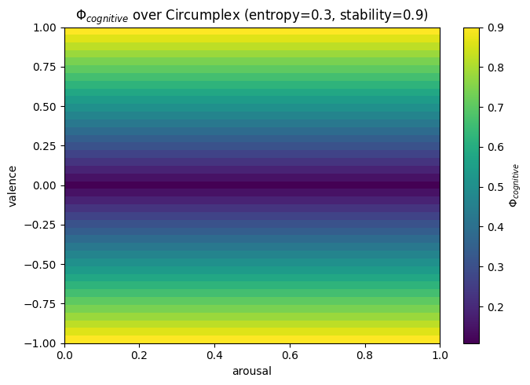

# Phionyx Core SDK

**Deterministic AI runtime that treats LLM outputs as sensor measurements, not decisions.**

[](https://github.com/halvrenofviryel/phionyx-research)
[](LICENSE)
[](https://www.python.org/downloads/)
[](tests/)

Most AI frameworks let the LLM decide. Phionyx doesn't. Every LLM response passes through a 46-block deterministic pipeline with safety gates, ethics checks, and physics-based state tracking — before it reaches the user.

---

## What Makes This Different

| Feature | Typical LLM Framework | Phionyx |
|---------|----------------------|---------|
| LLM role | Decision maker | Sensor (output is measurement, not truth) |
| Response control | Post-hoc filtering | Pre-response governance (46-block pipeline) |
| State tracking | Stateless or conversation history | Structured state vector (A, V, H, phi, entropy) |
| Safety | Optional guardrails | Mandatory gates (kill switch, ethics, HITL) |
| Determinism | Non-deterministic | Reproducible cognitive path |
| Memory | RAG / vector search | Impact-weighted semantic time eviction |

---

## Quick Start

```bash
# Install from source
git clone https://github.com/halvrenofviryel/phionyx-research.git
cd phionyx-research
pip install -e .
```

```python
from phionyx_core import EchoOrchestrator, OrchestratorServices

services = OrchestratorServices()
orchestrator = EchoOrchestrator(services=services)

result = await orchestrator.run(
    user_input="How can I improve my study habits?",
    mode="edu",
    current_amplitude=5.0,
    current_entropy=0.3
)
# Returns: governed response + state metrics + audit trail
```

See [`examples/fastapi/`](examples/fastapi/) for an HTTP endpoint wrapper.

---

## Try It In 30 Seconds

Three short notebooks demonstrate the substrate without an LLM, server, or external account. Each runs end-to-end and embeds its outputs.

| # | Notebook | Shows |
|---|----------|-------|
| 01 | [Determinism and Physics](examples/notebooks/01_determinism_and_physics.ipynb) | `EchoState2`, `calculate_phi_v2_1`, 1000-run determinism proof, side-by-side with a noisy alternative |
| 02 | [Kill Switch in Action](examples/notebooks/02_kill_switch_in_action.ipynb) | `KillSwitch` with 4 triggers + NaN fail-closed guard, tamper-evident event log |
| 03 | [Pipeline Blocks and Audit](examples/notebooks/03_pipeline_blocks_and_audit.ipynb) | Canonical 46-block pipeline (v3.8.0), custom block subclass, 100-run determinism |

Notebook 01 sweeps the cognitive component of Φ across the full Circumplex (valence × arousal). The surface is smooth, bounded, and reproducible bit-for-bit — there is no LLM involved at this layer.



```bash
pip install jupyter matplotlib
jupyter notebook examples/notebooks/
```

---

## Architecture

Phionyx implements three integrated layers:

**Layer 1 — Deterministic Cognitive Kernel**
- 46-block canonical pipeline (contract v3.8.0)
- Structured state vector: arousal, valence, entropy, time
- Hybrid Resonance Model for cognitive quality (Phi)
- Response revision gate: `pass | damp | rewrite | regenerate | reject`

**Layer 2 — Safety & Governance**
- 4-gate pre-response control (Outbound, Merge, Release, Data)
- Kill switch with 4 triggers (fail-closed)
- Deliberative ethics engine (4-framework reasoning)
- Human-in-the-loop queue with priority and expiry
- Ed25519-signed audit trail with hash chains

**Layer 3 — Semantic Time Memory**
- Impact-weighted cache eviction (+24% vs LRU, +72% vs FIFO)
- Monotonic semantic clock (t_local, t_global)
- Phi-decay for memory relevance

---

## Core Concepts

### State Vector

Every interaction maintains a structured state:

```python
from phionyx_core import EchoState2

state = EchoState2(
    A=0.5,       # Arousal (0.0-1.0)
    V=0.0,       # Valence (-1.0 to 1.0)
    H=0.3,       # Entropy (0.0-1.0)
    dA=0.0,      # Arousal derivative
    dV=0.0,      # Valence derivative
    t_local=0.0, # Semantic time (local)
    t_global=0.0 # Semantic time (global)
)
```

### Pipeline Blocks

```python
from phionyx_core.contracts.telemetry import get_canonical_blocks

blocks = get_canonical_blocks()  # 46 blocks (v3.8.0)
```

### Profiles

```python
from phionyx_core import ProfileManager

manager = ProfileManager()
profile = manager.load_profile("edu")  # or "game", "clinical"
```

---

## Testing

```bash
pytest tests/                          # All tests (2,571)
pytest tests/unit/core/ -q             # Core unit tests
pytest tests/contract/ -q              # Contract tests
pytest tests/behavioral_eval/ -q       # Behavioral evaluation
```

---

## Evaluation Standard

Phionyx systems are evaluated against the [Phionyx Evaluation Standard v0.1](https://github.com/halvrenofviryel/phionyx-evaluation-standard):

- **Determinism Grading (D0-D3):** Non-deterministic to fully deterministic
- **Evaluation Levels (L0-L3):** Unmeasured to governance-grade
- **Composite Quality Score (CQS):** Multi-dimensional behavioral quality metric

---

## Contributing

Contributions welcome! See [CONTRIBUTING.md](CONTRIBUTING.md) for guidelines.

Check out [Good First Issues](https://github.com/halvrenofviryel/phionyx-research/issues?q=is%3Aissue+is%3Aopen+label%3A%22good+first+issue%22) for a place to start.

---

## License

**AGPL-3.0** — See [LICENSE](LICENSE) for details.

A commercial license is available for use cases where AGPL-3.0 copyleft is not suitable. Patent rights retained by Phionyx Research. See [PATENT_NOTICE.md](PATENT_NOTICE.md).

---

## Further Reading

- [Why Every AI Runtime Needs a Kill Switch](https://phionyxresearch.substack.com/p/why-every-ai-runtime-needs-a-kill)
- [Inside the 46-Block Deterministic AI Pipeline](https://phionyxresearch.substack.com/p/inside-the-46-block-deterministic)

---

## Links

- **Website:** [phionyx.ai](https://phionyx.ai)
- **Evaluation Standard:** [phionyx-evaluation-standard](https://github.com/halvrenofviryel/phionyx-evaluation-standard)
- **arXiv Paper:** Submission pending (cs.AI)
- **Author:** Ali Toygar Abak ([Phionyx Research](https://phionyx.ai))

---

## Citation

```bibtex
@techreport{abak2026phionyx,
  author      = {Abak, Ali Toygar},
  title       = {Phionyx: A Deterministic AI Runtime Architecture with Structured State Management and Pre-Response Governance},
  institution = {Phionyx Research},
  year        = {2026},
  url         = {https://github.com/halvrenofviryel/phionyx-research}
}
```
