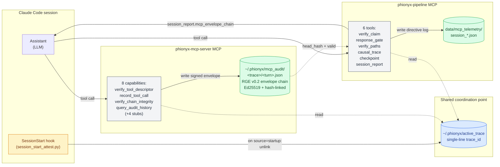

# Figure 1 — Two-layer MCP architecture with shared `trace_id` (ADR-0006)

**Caption.** Both MCP servers resolve the active `trace_id` from the same file (`~/.phionyx/active_trace`) per ADR-0006, with `PHIONYX_TRACE_ID` env var as a higher-precedence override. The pipeline MCP writes per-tool directive logs to project-local JSON; the server MCP writes signed, hash-chained RGE v0.2 envelopes to the user's home directory. The pipeline MCP's `session_report` surfaces the server MCP's chain head via the optional `mcp_envelope_chain` field, joining the two MCPs' views without merging the packages. The `SessionStart` hook resets the shared file on `source=startup` so a fresh trace is generated by the first MCP call of the new conversation.
