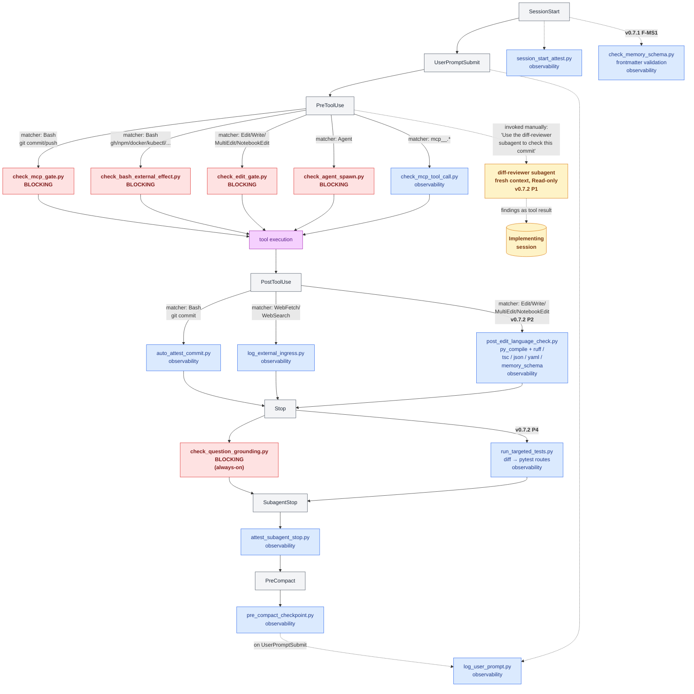

# Figure 2 — Claude Code lifecycle with 15 hook attachment points + subagent layer

**Caption.** Fifteen hooks are wired to seven Claude Code lifecycle events. Five hooks are **blocking** (red): they refuse the tool call when a recent gate invocation is missing, with strict mode (`PHIONYX_MCP_GATE_STRICT=1`) escalating warnings to hard blocks. Ten hooks are **observability** (blue): they write `auto_attest` entries that contribute to activity visibility but are **excluded from coverage math** by construction (see §5.3). The `check_question_grounding.py` Stop hook is always-on (no env-var disable) and blocks responses that reference unread artefacts. The three v0.7.2 additions (rows 13–14 in Table 1, plus the row 7 memory-schema check that shipped in v0.7.1) close the *feedback* gap: per-edit language tools, per-Stop targeted tests, and per-session memory-schema validation. The **adversarial diff-reviewer subagent** (orange, v0.7.2 P1) sits above the hook layer — invoked manually, runs in a fresh context, returns findings as a tool result. Together, the blocking class binds gate invocation deterministically while the subagent layer adds semantic review that no syntactic hook can perform.
