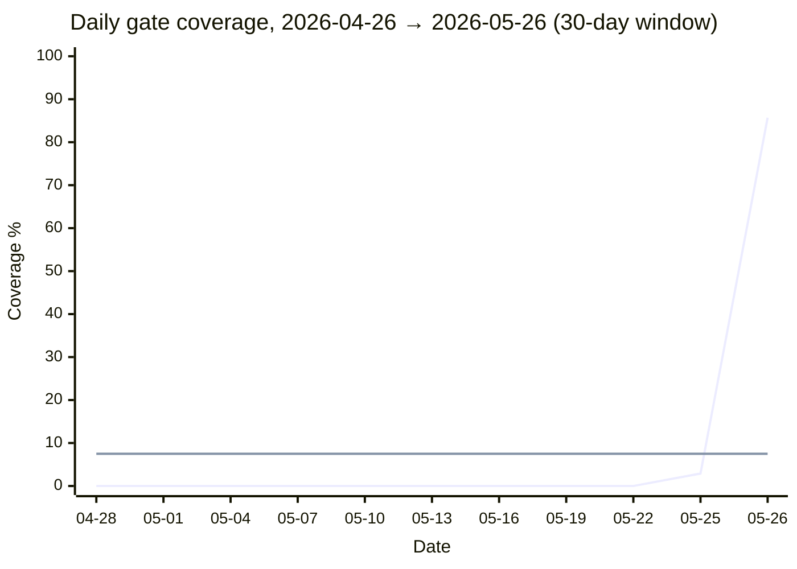

# Figure 4 — Coverage timeline

This figure is best rendered as a matplotlib line chart. See `render_figures.py` for the rendered PNG/PDF (used for arXiv submission). The Mermaid below is an inline-readable approximation.



**Caption.** Daily gate coverage on the Phionyx repository, over the 30-day window ending 2026-05-26. The 30-day rolling baseline measurement on 2026-05-25 reads **7.5%**; the 30-day re-measurement on 2026-05-26 (after the intervention described in §6) reads **9.5%**. The single high-coverage day (2026-05-26 at 85.7%) is the post-intervention author session itself: a heavily gated working day produced the +2 percentage-point bump in the rolling average. **This is not yet the structural effect of the new hooks** — the binding hooks landed today and the measurement window mostly precedes them. The structural effect is a falsifiable forecast (§6.5): re-running this script in 30 days should show a substantially higher rolling average; if it does not, the hook design failed.

**Note on rendering.** The `xychart-beta` Mermaid chart is rendered inline on GitHub and Substack. For arXiv submission, run:

```bash
python3 render_figures.py --figure 4
```

which produces `fig4_coverage_timeline.png` and `.pdf` from the same data points (matplotlib).
