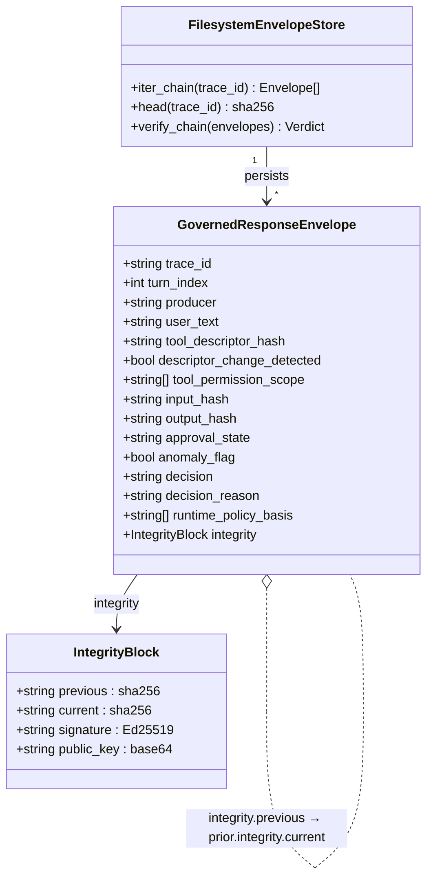

# Figure 5 — Governed Response Envelope v0.2: schema + chain linkage

**Caption.** Each Governed Response Envelope records one tool call's full evidential footprint: the descriptor hash at invocation time (used for tool-poisoning / rug-pull detection per Jamshidi et al.), input and output hashes (so the actual payload can be omitted from the public record without losing replay equivalence), the gate decision and the basis (e.g. `phionyx_response_gate.pass`), and an `IntegrityBlock` containing `previous` (SHA-256 of the prior envelope), `current` (SHA-256 of this envelope's canonical-JSON form), and an Ed25519 signature with the producer's public key. The chain is therefore tamper-evident: any modification breaks the `current` hash, which breaks the next envelope's `previous` reference, which breaks the signature. `FilesystemEnvelopeStore.verify_chain` walks the chain and reports `{valid, broken_at, reason}`.
