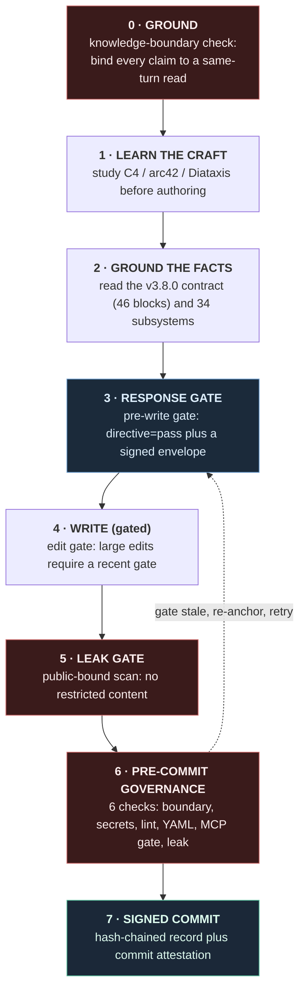

# Provenance — how `ARCHITECTURE.md` was produced *through* the runtime

> **One line:** the runtime's own architecture document was not merely *written about*
> Phionyx — it was authored *through* Phionyx's governance, and this folder is the
> redacted, independently-checkable evidence of that.

This is a small, self-contained **dogfood** artifact. It accompanies
[`../../ARCHITECTURE.md`](../../ARCHITECTURE.md), which describes Phionyx's pipeline,
gates, and signed-evidence machinery. The point of this folder is narrower and more
testable: *those same gates were applied, in real time, to the agent that wrote the
document* — and you can verify the part of that claim that is publicly checkable, yourself,
in under a minute.

---

## TL;DR — verify it yourself

```bash
python3 verify_chain.py
# records         : 8
# continuity      : OK (append-only chain intact)
# head            : sha256:2997f4d6...fca9c629
# head matches doc: OK
```

That command re-checks the append-only hash chain in
[`architecture_md_authoring_chain.jsonl`](architecture_md_authoring_chain.jsonl) — the
redacted gate transcript from the authoring session. Reorder or alter a single record and
it exits non-zero. No third-party dependencies (Python 3.8+ stdlib only).

---

## What this folder contains

| File | What it is |
|---|---|
| [`architecture_md_authoring_chain.jsonl`](architecture_md_authoring_chain.jsonl) | The **redacted, signed gate transcript** — one record per authoring turn: chain hashes, the demo-HMAC signature, the φ metric, the gate decision (`pass` / `release`), and the safety flag. **No prompt text, no model output, no reasoning prose** — only the governance metadata. |
| [`verify_chain.py`](verify_chain.py) | A self-contained verifier that re-checks chain continuity and that the head matches the value cited in `ARCHITECTURE.md`. |
| `README.md` | This file. |

---

## The authoring turn, as a governed pipeline

Writing the document was itself a governed sequence. Each stage is a Phionyx control
surface; the same primitives are described in `ARCHITECTURE.md` §7–§8.



Each pre-write **response gate** call emitted one signed, hash-chained envelope. The eight
records in the transcript are those envelopes — the chain whose head,
`sha256:2997f4d6…fca9c629`, is the value `ARCHITECTURE.md`'s provenance colophon cites.
The blocking events along the way (a stale anchoring gate; an ungrounded claim caught by
the `Stop` hook) were enforced by the lifecycle hooks rather than recorded as response-gate
envelopes; they are described in the architecture document and are *attested, not* part of
this public transcript.

---

## The honest split — what is verifiable, and where

This is the part most "we govern our AI" claims skip. Stated plainly:

### ✅ Publicly verifiable today (no access to us required)

- **This chain's continuity and head.** `python3 verify_chain.py` — above.
- **The runtime that did the governing.** The package is open source and on PyPI; clone
  this repo and run its CI, or:
  ```bash
  pip install phionyx-core            # the runtime; signed reproducibility pack on each GitHub release
  ```
- **The evidence record format.** The vendor-neutral AI Runtime Evidence Protocol and its
  two-implementation conformance kit (Python + Node, RFC 8785 canonical JSON):
  [`github.com/halvrenofviryel/ai-runtime-evidence-protocol`](https://github.com/halvrenofviryel/ai-runtime-evidence-protocol).

### 🔒 Real, but internal (attested — not externally re-runnable as-is)

- **Signature authenticity.** The signatures in the transcript are the MCP boundary's
  *demo* HMAC (`demo-hmac:…`), not the core Ed25519 signer. The signing key and the full
  per-turn **decision envelopes** (which bind each gate's inputs and outputs) live in the
  private development monorepo. So `verify_chain.py` checks **continuity, not authenticity**,
  and cannot prove the chain commits to `ARCHITECTURE.md`'s specific bytes.
- **The authoring commit and full session trace.** They exist and are signed, but in a
  private repository.

So the externally-checkable claim is deliberately **narrower than the full story**: *the
runtime and the protocol are public and reproducible; this authoring chain is continuous
and its head matches the document; full cryptographic authentication and the underlying
envelopes are internal.* We would rather state that boundary than blur it.

---

## What this proves — and what it does not

**Proves.** The governance is *executable at runtime*, not aspirational. It shaped, gated,
and recorded the production of a real artifact — including by **blocking** the author when
discipline lapsed and forcing a correction. The runtime is trustworthy enough to govern the
agent that documents it.

**Does not prove.** That the *content* of `ARCHITECTURE.md` is correct — only that its
*production process* was governed and recorded. Correctness rests on the source-of-truth
rule: the code wins, and the contract tests are the arbiter. Nor does it claim the authoring
agent "understands" anything; the gates govern **behaviour and evidence, not cognition**.

---

> *Claim ≤ Evidence.* This artifact is published so the claim can be checked rather than
> trusted. Scrutiny — including of the boundary above — is invited.
